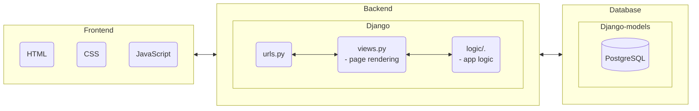
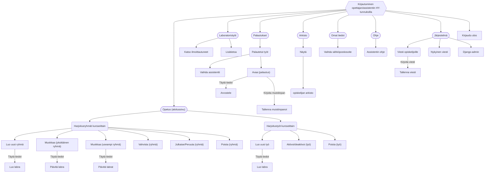
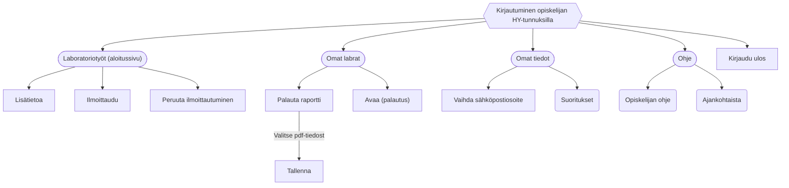

# Architecture

### Basic structure

  
### Teachers' view

### Students' view

### Languages and techniques:
- CSS
- Django
- Docker
- HTML
- JavaScript
- OpenID
- Playwright
- PostgreSQL
- Python

### Libraries:
| Library               | Version     | Description                                                                                     |
|-----------------------|-------------|-------------------------------------------------------------------------------------------------|
| lazy-object-proxy     | 1.9.0       | A fast and feature-rich proxy object implementation.                                            |
| typing-extensions     | 4.7.1       | Backport of the standard library module `typing` for use in Python versions earlier than 3.10. |
| wrapt                 | 1.15.0      | A Python module for decorators, wrappers, and monkey patching.                                   |
| asgiref               | 3.7.2       | ASGI (Asynchronous Server Gateway Interface) framework.                                         |
| astroid               | 2.15.8      | A library for abstract syntax trees (AST) and Python code analysis.                              |
| certifi               | 2023.7.22   | Certifi provides the Mozilla CA Bundle for SSL certificate verification.                         |
| charset-normalizer    | 3.3.0       | Charset normalization library for Python.                                                       |
| dill                  | 0.3.7       | A utility for serialization of Python objects.                                                   |
| exceptiongroup        | 1.1.3       | A utility for grouping exceptions in Python.                                                     |
| idna                  | 3.4         | A library for handling Internationalized Domain Names in Applications (IDNA).                  |
| iniconfig             | 2.0.0       | A configuration file parser for Python projects.                                                 |
| isort                 | 5.12.0      | A tool for sorting Python imports.                                                               |
| mccabe                | 0.7.0       | Complexity checker for Python code.                                                              |
| packaging             | 23.1        | Core utilities for Python packages.                                                              |
| platformdirs          | 3.10.0      | A small Python library for finding directories based on the platform.                            |
| pycparser             | 2.21        | A parser for the C programming language, written in Python.                                      |
| pluggy                | 1.3.0       | A plugin manager for Python applications.                                                        |
| sqlparse              | 0.4.4       | A non-validating SQL parser for Python.                                                          |
| tomli                 | 2.0.1       | A TOML parser for Python.                                                                       |
| urllib3               | 2.0.6       | A powerful HTTP client for Python.                                                               |
| cffi                  | 1.16.0      | A foreign function interface for calling C functions from Python.                                |
| django                | 4.2.5       | A high-level Python web framework.                                                               |
| greenlet              | 2.0.2       | Lightweight in-process concurrent programming.                                                  |
| pyee                  | 9.0.4       | A Python library for event emitters and observers.                                               |
| pylint                | 2.17.7      | A static code analysis tool for Python.                                                          |
| pytest                | 7.4.1       | A testing framework for Python.                                                                  |
| requests              | 2.31.0      | HTTP library for Python.                                                                        |
| text-unidecode        | 1.3         | A Python library that provides ASCII transliterations of Unicode text.                           |
| cryptography          | 41.0.5      | A package designed to expose cryptographic primitives and recipes to Python developers.        |
| django-appconf        | 1.0.5       | A helper class for handling configuration defaults of Django applications.                        |
| playwright            | 1.38.0      | A Python library to automate browser actions using the Playwright tool.                           |
| pylint-plugin-utils   | 0.8.2       | Utility functions and classes for writing plugins for Pylint.                                    |
| pytest-base-url       | 2.0.0       | A Pytest plugin for setting a base URL for tests.                                                |
| python-slugify        | 8.0.1       | A Python library that converts a string to a slug.                                               |
| authlib               | 1.2.1       | A comprehensive authentication library for Python web frameworks.                                 |
| coverage              | 7.3.0       | Code coverage measurement for Python.                                                            |
| django-cryptography   | 1.1         | Integration of cryptography tools with Django.                                                   |
| django-environ        | 0.11.2      | A Django library for handling environment variables.                                              |
| invoke                | 2.2.0       | A Python task execution tool and library.                                                        |
| psycopg2              | 2.9.7       | PostgreSQL adapter for Python.                                                                  |
| pylint-django         | 2.5.3       | A Pylint plugin for improving Django code analysis.                                              |
| pytest-playwright     | 0.4.2       | A Pytest plugin for using Playwright with Pytest.                                                |